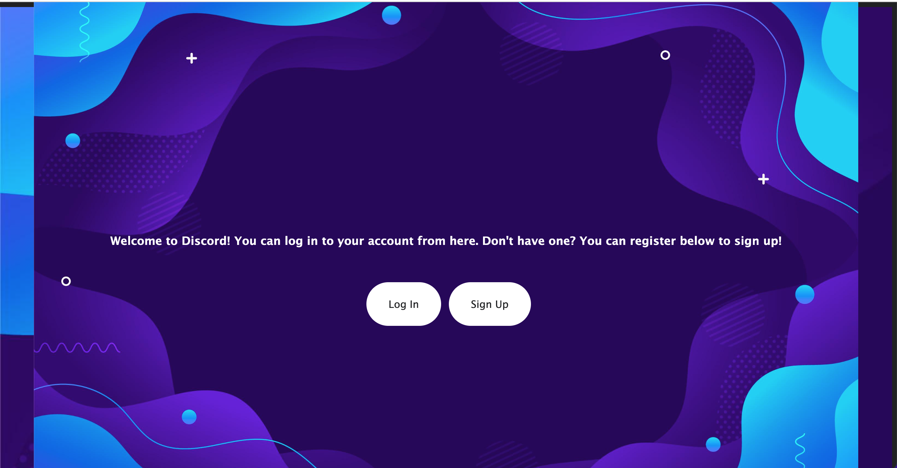
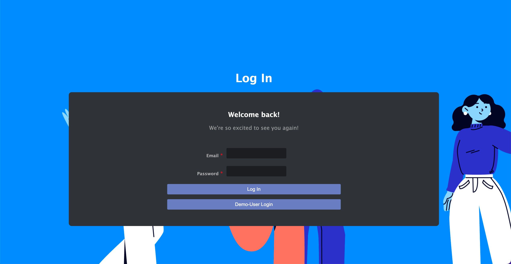
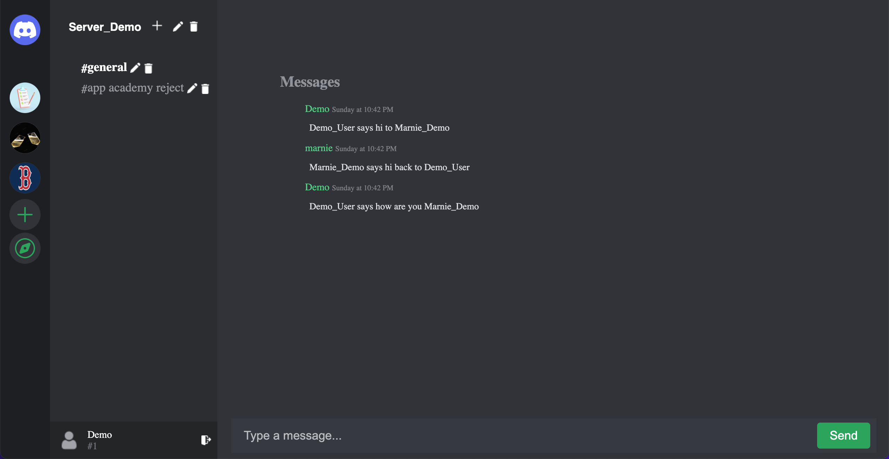
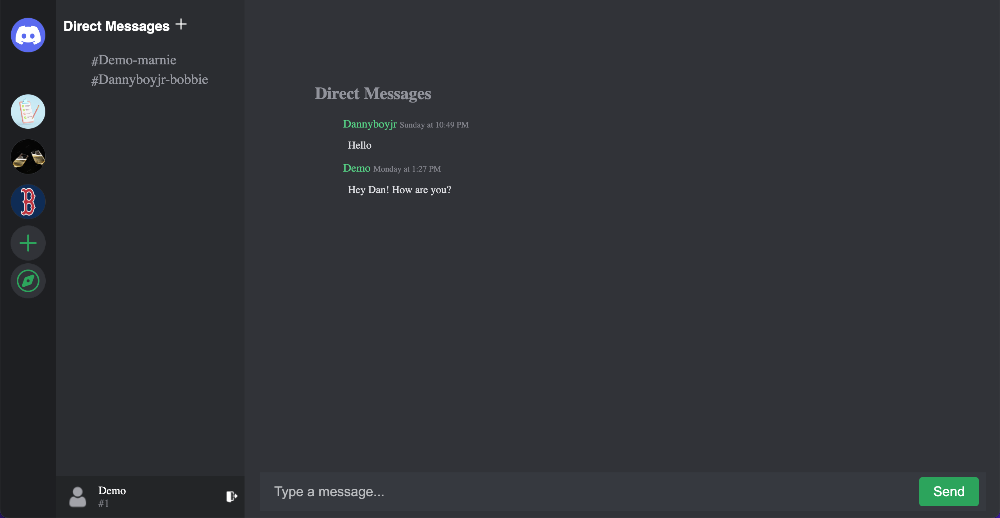
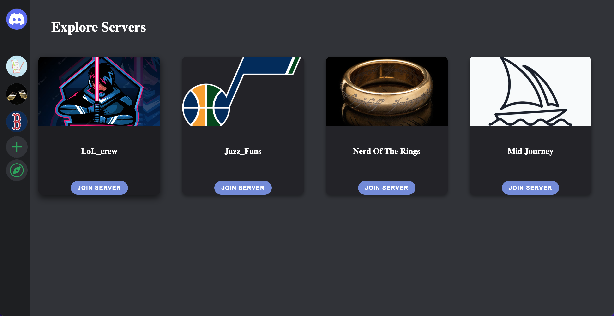

<h1>Discord-clone </h1>

Welcome to the Discord-clone project! This project is a recreation of the popular communication platform designed for creating communities. The goal of this project is to provide users with a similar experience to the original Discord website, including the ability to create servers, channels, and messaging.

<h1>Screenshots</h1>

Please see the screenshots folder for examples of the project in action.

<h1>CRUD Features</h1>
The Discord-Clone project includes full CRUD (Create, Read, Update, Delete) features for both the servers and and channels sections of the website. There are partial curds for reading and sending messages for channels and private dms. Additionally, users can join and leave servers of their choosing.

<h2 align=center>Technologies</h2>

  
  
   
  
  
  
  
  
   
  

 

<h1>how to get started </h1>

Clone the repository and navigate to the project directory
Run npm install to install all necessary dependencies within the react-app folder.
Create a .env file and add the following variables:
SECRET_KEY=lkasjdf09ajsdkfljalsiorj12n3490re9485309irefvn,u90818734902139489230
DATABASE_URL=sqlite:///dev.db
SCHEMA=flask_schema

To build or reset the database and run seeders, run the following comands in the root folder.  1. pipenv shell 2. flask db upgrade 3. flask seed all. once you've run those three commands, start up the back end server in ther root directory by running flask run (make sure you're in your pipenv shell) head to the react-app folder and run npm start.
The application should now be running on the port specified in your .env file.
Please note that the above instructions assume that you have the necessary dependencies installed on your machine. If you are missing any dependencies, please refer to their respective documentation to learn how to install them. 

